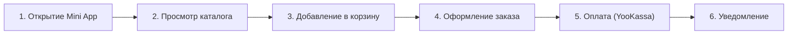
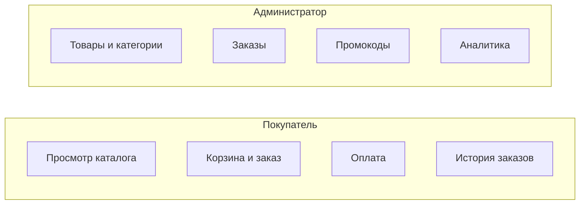

# Диаграммы для главы 1 (описания и исходники)

Ниже приведены описания и, где возможно, исходники в формате Mermaid для генерации рисунков в ПЗ. Диаграммы нужно экспортировать в изображения (PNG/SVG) и вставить в пояснительную записку с подписью «Рисунок N — Название. Источник: составлено автором.»

---

## IDEF0 (контекстная диаграмма, уровень A0)

**Название:** Контекстная диаграмма системы «Платформа интернет-магазина в Telegram»

**Описание:**
- **Вход:** запросы пользователей, данные о товарах и заказах, платёжные данные.
- **Выход:** отображение каталога и заказов, подтверждения оплаты, уведомления, отчёты для владельца.
- **Управление:** настройки бизнеса, правила скидок и лояльности, настройки оплаты.
- **Механизмы:** Mini App, Backend API, БД, YooKassa, Telegram Bot.

В ПЗ рисуется в нотации IDEF0 (прямоугольник с входами слева, выходами справа, управлением сверху, механизмами снизу). Mermaid для IDEF0 не стандартизирован, диаграмму рекомендуется нарисовать в редакторе (Draw.io, Visio, или специализированный IDEF0-редактор).

---

## DFD (поток данных, уровень 0)

**Название:** Диаграмма потоков данных (DFD), уровень 0

Используйте существующий файл в проекте: `presentation_diagrams/slide_09_system_flow.mmd` — это sequence diagram. Для классической DFD нарисуйте вручную или в Draw.io:
- Внешние сущности: Покупатель, Администратор магазина, Платёжная система (YooKassa), Telegram.
- Процессы: «Mini App», «Backend API», «Создание платежа», «Уведомление».
- Хранилища: «База данных» (заказы, товары, пользователи).
- Потоки: запрос каталога, данные заказа, ссылка на оплату, webhook, уведомление.

---

## BPMN (сценарий заказа)

**Название:** Сценарий оформления и оплаты заказа (BPMN)

Текст сценария для отрисовки в BPMN:
1. Старт (открытие Mini App).
2. Пользователь просматривает каталог → добавляет товары в корзину → переходит к оформлению.
3. Заполнение контактов и адреса.
4. Выбор способа оплаты (онлайн / при получении).
5. Если онлайн: создание платежа в API → редирект в YooKassa → оплата → webhook → обновление статуса заказа → уведомление в Telegram.
6. Если при получении: сохранение заказа со статусом «ожидает оплаты» → уведомление.
7. Конец.

Mermaid (упрощённый flowchart, не полноценный BPMN, но подойдёт как иллюстрация):

Полноценную BPMN лучше нарисовать в Draw.io или Camunda Modeler.

---

## UML Use Case

**Название:** Диаграмма вариантов использования (UML)

**Акторы:**
- Покупатель (Mini App).
- Администратор магазина (админ-панель).

**Варианты использования (пример):**
- Покупатель: Просмотр каталога, Просмотр карточки товара, Добавление в корзину, Оформление заказа, Оплата, Просмотр истории заказов, Просмотр баллов лояльности, Настройки (язык, тема).
- Администратор: Вход в админ-панель, Управление товарами, Управление категориями, Управление заказами (статусы), Управление промокодами, Просмотр аналитики.

Mermaid (пример):

Для настоящей Use Case диаграммы (овалы и акторы) используйте Draw.io или PlantUML.

---

## ER-диаграмма (сущности БД)

В проекте уже есть: `presentation_diagrams/slide_06_er_diagram.mmd`. Можно использовать для рисунка «Сущности и связи БД» в подразделе 1.1. Рендер Mermaid в PNG/SVG и вставка в ПЗ с подписью.

---

Итог: для строгого соответствия нотациям IDEF0, DFD, BPMN, UML используйте визуальные редакторы; Mermaid подходит для быстрых иллюстраций и ER. Все рисунки в ПЗ должны быть пронумерованы и подписаны.
